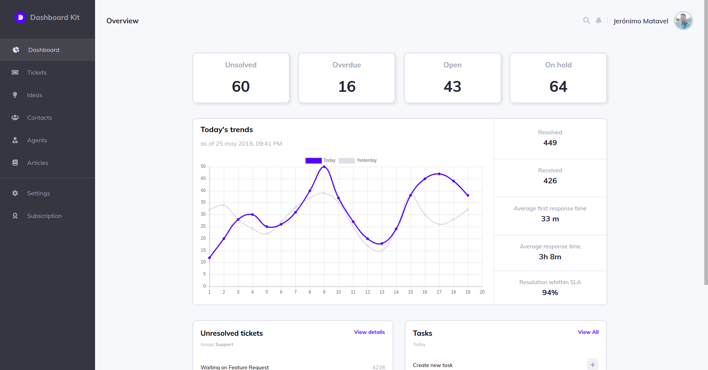

# Admin Dashboard



<p align="center">
    <br />
    <a href="https://admin-dashboard-smoky.vercel.app">View Demo</a>
    ·
    <a href="https://github.com/jeronimo-mz/admin-dashboard/issues">Report Bug</a>
    ·
    <a href="https://github.com/jeronimo-mz/admin-dashboard/issues">Request Feature</a>
  </p>
<br/><br/>
<!-- TABLE OF CONTENTS -->
<details open="open">
  <summary>Table of Contents</summary>
  <ol>
    <li>
      <a href="#-the-project">About The Project</a>
      <ul>
        <li><a href="#-techs">Technologies</a></li>
        <li><a href="#-layout">Layout</a></li>
        <li><a href="#-deploy">Deploy</a></li>
      </ul>
    </li>
    <li>
      <a href="#-getting-started">Getting Started</a>
      <ul>
        <li><a href="#prerequisites">Prerequisites</a></li>
        <li><a href="#installation">Installation</a></li>
        <li><a href="#running-the-project">Running the project</a></li>
      </ul>
    </li>
    <li><a href="#-contributing">Contributing</a></li>
    <li><a href="#-contact">Contact</a></li>
    <li><a href="#-licence">License</a></li>
  </ol>
</details>

---

## 💻 The Project

This project is a reproduction of the layout of an Admin Dashboard built using ReactJs & Typescript.

### ✨ Techs

This project was built using the following technologies:

-   [ReactJS](https://reactjs.org/)
-   [TypeScript](https://www.typescriptlang.org/)
-   [Yarn](https://yarnpkg.com/)
-   [Chart.js](https://www.chartjs.org)
-   [React-chartjs-2](reactchartjs.github.io/react-chartjs-2/)
-   [CSS Modules](https://github.com/css-modules/css-modules) (already included in create-react-app)
-   [Create React App](https://github.com/facebook/create-react-app)

### 🔖 Layout

You can access the layout of the project through this [link](<https://www.figma.com/file/mL65Vhhcnv4ZOmUKlsNdGI/Figma-Admin-Dashboard-UI-Kit-(Community)?node-id=584%3A31>). A [Figma](https://www.figma.com/) account is required to access it.

### 🚀 Deploy

the deployment was made at [Vercel](https://vercel.com/) and can be accessed through this [link](https://admin-dashboard-smoky.vercel.app).

---

## 🚀 Getting Started

### Prerequisites

To run this project you must have [Yarn](https://yarnpkg.com/) installed on your machine

### Installation

1. Clone the repository
    ```sh
    $ git clone https://github.com/Jeronimo-MZ/admin-dashboard.git
    ```
2. Move to the project directory

    ```sh
    $ cd admin-dashboard
    ```

3. Install the dependencies
    ```sh
    $ yarn
    ```

### Running the project

1. Move to the project directory
    ```sh
    $ cd admin-dashboard
    ```
2. start the project on the local server

    ```sh
      $ yarn dev
    ```

3. open [http://localhost:3000](http://localhost:3000) on your browser to see the project running

## 🦸 Contributing

Contributions are what make the open source community such an amazing place to be learn, inspire, and create. Any contributions you make are **greatly appreciated**.

1. Fork the Project
2. Create your Feature Branch (`git checkout -b feature/AmazingFeature`)
3. Commit your Changes (`git commit -m 'Add some AmazingFeature'`)
4. Push to the Branch (`git push origin feature/AmazingFeature`)
5. Open a Pull Request

## 🦸 Contact

<a href="https://github.com/Jeronimo-MZ">
 <b>Jerónimo Matavel</b></a> <a href="https://www.linkedin.com/in/jeronimo-matavel/" title="Jerónimo Matavel">🚀</a>
 <br/>

Project Link: <a href="https://github.com/Jeronimo-MZ/admin-dashboard">https://github.com/Jeronimo-MZ/admin-dashboard</a>
<br/>

[](https://www.linkedin.com/in/jeronimo-matavel/)
[](mailto:mataveljeronimo@gmail.com)

---

## 📝 Licence

Distributed under the MIT License. See [LICENCE](./LICENSE) for more information.

<p align="center">
Made With ❤️ by Jerónimo Matavel 👋🏽 <a href="https://www.linkedin.com/in/jeronimo-matavel/">Contact me!</a>
</p>
